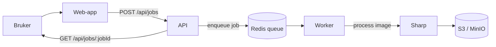

# pixpipe

Pixpipe er en liten, “ekte” bildeplattform der brukeren laster opp et bilde, og systemet prosesserer det asynkront (thumbnail/resize/watermark) via en kø og workers. Du får en jobId, kan følge status, og hente ferdige resultater.


## Architecture



## Modern MVP stack (learn-by-building)
- **TypeScript monorepo** (pnpm workspaces)
- **API:** Fastify + multipart upload
- **Queue:** Redis + BullMQ
- **Worker:** Node + Sharp (image processing)
- **Storage:** S3 API (MinIO in dev)
- **DB (next step):** Postgres + Prisma (schema included, wiring next)
- **Web:** React + Vite + Tailwind

## Quickstart

### 0) Prereqs
- Node 20+
- pnpm 9+
- Docker

### 1) Start infra
```bash
docker compose up -d
```

### 2) Configure env
```bash
cp .env.example .env
```

### 3) Install deps
```bash
pnpm install
```

### 4) Run apps
In separate terminals:
```bash
pnpm -C apps/api dev
pnpm -C apps/worker dev
pnpm -C apps/web dev
```

- Web: http://localhost:3000
- API: http://localhost:3001/health
- MinIO console: http://localhost:9001 (minio / minioadmin)

## API (current)
- `POST /api/jobs` (multipart field name: `file`) → `{ jobId }`
- `GET /api/jobs/:jobId` → placeholder status (DB wiring is next)

## Next steps
1) Wire API + Worker to Postgres via Prisma
2) Track job state: QUEUED → PROCESSING → COMPLETED/FAILED
3) Add `GET /api/jobs/:jobId/result` (download/proxy thumbnail)
4) Add watermark + more transforms


